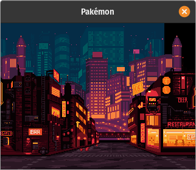

# pakemon-demos

This is a collection of ideas/demos where I basically implement the intro screen or some small part of pakemon to evaluate different languages and game frameworks.

I feel like I am endlessly evaluating stuff, and writing demos, so I am hoping to lock-in to something that works well (enough), soon. I may add more features to a demo I end up wanting to pursue, but often as soon as I find an issue I move on to another evaluation. So far, [raylib](raylib/) performs the best on pi, in general, with the most features, but is a bit more complicated to get working (need C tools, deps, etc.) It should be noted that raylib also has lots of [language bindings](https://github.com/raysan5/raylib/blob/master/BINDINGS.md) that may or may not work ok. [love](love/) is much simpler to get started with, has all the frontend features I need, and seemed to perform ok (as long as I was very careful about how I wrote things.) [node-raylib](node-raylib/) might be the fastest for me to work with, with all the features I need, so I need to do more testing on pi0 to make sure it performs enough like native.

## demos

- [bevy](bevy/) - [☢️](https://www.rust-lang.org/)
- [deno/sdl2](deno-sdl2/) - [☕](https://developer.mozilla.org/en-US/docs/Web/JavaScript/Reference) 🎬 🕸️
- [dome](dome/) - [🐤](https://wren.io/) 🌄 🥧 
- [haxe](haxe/) - [☕](https://developer.mozilla.org/en-US/docs/Web/JavaScript/Reference) 🔈 🐈 🌄 🎬 🕸️ 🥧 
- [html5-canvas](html5-canvas/) - [☕](https://developer.mozilla.org/en-US/docs/Web/JavaScript/Reference) 
- [lua/love](love/) - [🌙](https://www.lua.org/) 🔊 🐈 🌄 🎬 🕸️ 🥧
- [rust/macroquad](macroquad/) - [☢️](https://www.rust-lang.org/) 🐈 🌄 🕸️ 🥧
- [node/raylib](node-raylib/) - [☕](https://developer.mozilla.org/en-US/docs/Web/JavaScript/Reference) 🔊 🐈 🌄 🎬
- [pygame](pygame/) - [🐍](https://www.python.org/) 🔊 🐈 🎬 🌄
- [raylib](raylib/) - [💣](https://en.cppreference.com/w/c/language) 🔊 🌄 🎬 🕸️ 🥧 🐈
- [rust/raylib](raylib-rs/) - [☢️](https://www.rust-lang.org/) 🌄 🕸️
- [sdl](sdl/) - [💣](https://en.cppreference.com/w/c/language) 🕸️ 🥧

## incomplete

I will get around to these, eventually

- [nim/raylib](nim-ray/)
- [python/kivy](py-kivy)

### implemented features

This is just what I actually implemented in the demo, not if the language/framework supports it.

- 🔈 - has sound (converted from mod to some other format)
- 🔊 - has sound (directly using mod file)
- 🌄 - parallax background implemented
- 🐈 - cat sprite animation implemented
- 🎬 - has nicely seperated scenes
- 🕸️ - built for web (or at least can be, with some work, that I may not have done in my demo setup)
- 🥧 - tested on pi0 and seems to run ok

### programming language

- [☢️](https://www.rust-lang.org/) - rust
- [🌙](https://www.lua.org/) - lua
- [💣](https://en.cppreference.com/w/c/language) - C/C++
- [☕](https://developer.mozilla.org/en-US/docs/Web/JavaScript/Reference) - javascript-like (ES) language
- [🐤](https://wren.io/) - wren
- [🐍](https://www.python.org/) - python

### networking

With many of these, networking (an essential feature for talking to the backend) is going to be an issue, either on native, or on the web. Generally, the node/deno/C/rust libraries can use a 3rd party cross-environment lib (using websockets via wasm or directly), but for example love2d compiled to wasm is not at all easy to set this up for (I will need to compile my own runtime with added websockets, at C level, and in wasm wrapper.) [Haxe](haxe/) was exceptional with this, as it used the same code on web and native (in C and neko vmachine, as well as wasm build.) With this in mind, I may drop the web as a potential target, intitially, and just focus first on getting it to run well, on the pi0.

### bugs

I am getting a minor glitch on parallax, on raylib-based demos ([raylib](raylib/) and [raylib-rs](raylib-rs/)). It may be how I am doing the scrolling, a type-conversion problem, or it may be a problem with offscreen-rendering in raylib. It seems to be fine in [node-raylib](node-raylib/).

## some I'd like to make

- quickjs/raylib - [☕](https://developer.mozilla.org/en-US/docs/Web/JavaScript/Reference) - [this](https://github.com/sntg-p/QuickJS-raylib) seems very incomplete, but I could see it performing better than nodejs, and it's cool it can be compiled to a standalone program. Maybe I could auto-generate bindings to make it simpler, like 1-for-1 raylib C API (initially)
- auto-generated node-raylib, using FFI - [☕](https://developer.mozilla.org/en-US/docs/Web/JavaScript/Reference) - Might perform better than [node-raylib](node-raylib/) and it would help get it working on 4.0 (instead of 3.5.) I had [trouble building](https://github.com/RobLoach/node-raylib/issues/98), but it can be built for 3.5 or could be updated.
- port js libray fully to web-apis - This seems huge, but I could see recreating node-raylib with browser APIs, so the code essentially works the same 
- [wray](https://github.com/TSnake41/raylib-wren) - [🐤](https://wren.io/) - lots of issues with deps and building, and release did not work for me
- [raylib-lua](https://github.com/TSnake41/raylib-lua) [🌙](https://www.lua.org/) - similar issues to wray, which it's based on
- [pyckitup](pyckitup/) - [☢️](https://www.rust-lang.org/)/[🐍](https://www.python.org/) - I did get this building at one time, but last I tried on linux could not build pyckitup due to rust errors

## other (sort of) related demos

Not all of these are public, so you may get a 404.

- [pakemon](https://github.com/notnullgames/pakemon) - prototyped ideas (in love) have been put here. This is the eventual target program for frontend.
- [nullos](https://github.com/notnullgames/nullos) - build SLD2/love optimized for pi0, and inject into raspbian
- [nullos-alpine](https://github.com/notnullgames/nullos-alpine) - ideas around similar, using alpine linux. I think raspbian/kali is probably a better base, but this is truly minimal.
- [pakemon-rust](https://github.com/notnullgames/pakemon-rust) - this is the start of some ideas about making a couple rust crates for frontend/backend, only backend is setup, and it's very incomplete
- [lol](https://github.com/notnullgames/lol) - the beggining of a simple RPG in Godot. Currently Godot does not perform well on pi0, but I have hope it will in the future
- [lol-love](https://github.com/notnullgames/lol-love) - the start of implementing a simple RPG in love, driven by tiled maps & other assets
- [denorat](https://github.com/notnullgames/denorat) - this is the basic server part of managing deployed RAT payloads, speaks over SSL-wrapped websockets
- [rattata](https://github.com/notnullgames/rattata) - start of rust-based manager of deployed RAT payloads. Uses tor + socket-server to obfuscate hacker's location 
- [amethyst-example](https://github.com/notnullgames/amethyst-example) - basic rust/amethyst boilerplate game
- [personality-builder](https://github.com/notnullgames/pakemon-personalitybuilder) - silly tool to allow you to edit a personality animation-set for pakemon

## credits

- [Cyberpunk Street Environment](https://ansimuz.itch.io/cyberpunk-street-environment) by ansimuz
- [The Golden Ages](https://modarchive.org/index.php?request=view_by_moduleid&query=78423) by 4mat
- can't remember where I got the cat sprites, looked around but couldn't find it. If anyone knows, let me know!
